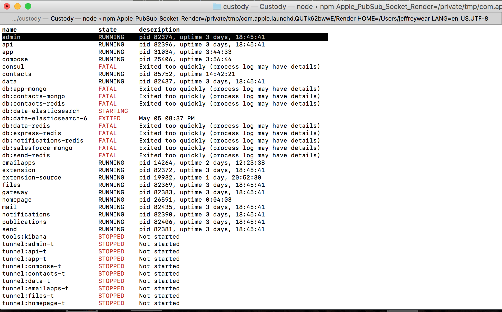
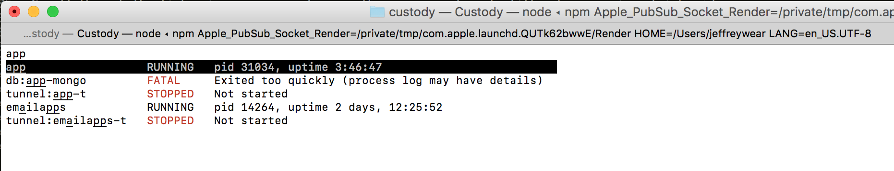
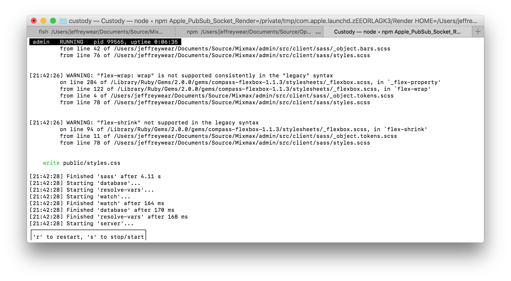

# custody

Supervisor is great for running a bunch of processes but not for running a local, microservices
development environment, where

* services frequently become unstable due to quirks of developers' setups or bugs in Supervisor
itself ([Mixmax-internal link](https://docs.google.com/document/d/1H37o4X51M5dWzrF5q_bOuZNaaag8iQYMebTEwjhJWBk/edit#heading=h.5tsycreyssqn))
* the processes monitored by Supervisor may be build e.g. `gulp` processes, not the services whose
states change i.e. webservers
* developers need to rapidly toggle between views of the environment's overall status and logs from
individual services

`supervisorctl status`' is too high-level and static for such an environment, and toggling between
that view and individual process logs is cumbersome.

Enter custody, which gives you a _realtime_ view of both the environment's overall status and
individual services' logs with _minimum keystrokes_.

## Installation

```sh
npm install -g custody-cli
```

## Configuration

By default, custody uses `/usr/local/var/custody` to store information and to enable [probe](https://github.com/mixmaxhq/custody-probe)->custody communication. You can override this directory by specifying the `CUSTODY_PROC_DIR` environment variable.

## Usage

Make sure that Supervisor is running. Then run

```sh
custody-cli
```

If you're running Supervisor on a port other than 9001 (Mixmax engineers: your default),
pass that using the `--port` flag.

This will show a view like `supervisorctl status`--except real-time and color-coded:



If the programs shown here are build processes, that in turn run server processes,
you can use [custody-probe](https://github.com/mixmaxhq/custody-probe)
to report the states of the servers.

Scroll through the list using your arrow keys or the mouse--or type to filter to a service of interest:



Hit enter or double-click on a service to open its logs:



Within this view, you can stop/start/restart the service using the keyboard shortcuts in the bottom toolbar.

### Notifications

If you run `custody-cli` with `--notifications`, it will show desktop notifications when the
services' states change. You can click the "Show" button on the notification to activate the Terminal
and open custody to the corresponding service's logs. This feature is experimental--please contribute
UX feedback!

If you'd like notifications to stay on the screen until dismissed, go to System Preferences ->
Notifications, look for "terminal-notifier" in the list at left, and change its alert style from
Banners to Alerts. We can't do this for you, unfortunately.

## Automatic error recovery

If you've added [probes](https://github.com/mixmaxhq/custody-probe) to any of your servers,
custody can automatically recover certain errors reported by those probes. In particular, if a
server reports an EADDRINUSE error (see https://github.com/mixmaxhq/custody/issues/3), custody will
automatically fix the port conflict by killing the process listening to your desired port, then
restarting your process.

## Contributing / Roadmap

We welcome bug reports and feature suggestions. PRs are even better!

Check out the issues and milestones to see what you could tackle to get this project to v1 and
beyond.
